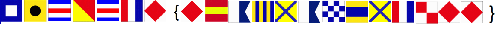
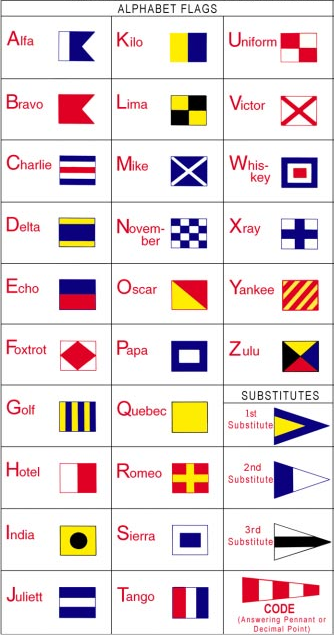
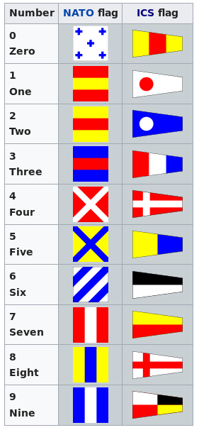

# Flags - 200 points
Cryptography

## Description:
> What do the flags mean?

## Hint:
> The flag is in the format PICOCTF{}

## Files:


## Solving:
So from the image we can see that each flag corresponds to a letter and since we can see the {}'s we know it's in flag format meaning the first flags can be sustituted for [P, I, C, O, C, T, F, {, F, , , , , , , , , , ,F ,F ,} ] 

After googling 'flag with white square in blue square' it turned up that the flags are part of NATO's international code of signals (maritime). From the wiki page we can see them next to the phonetic alphabet and we can begin to decode our flag.




### Flag: 

```c
PICOCTF{F1AG5AND5TUFF}
```
